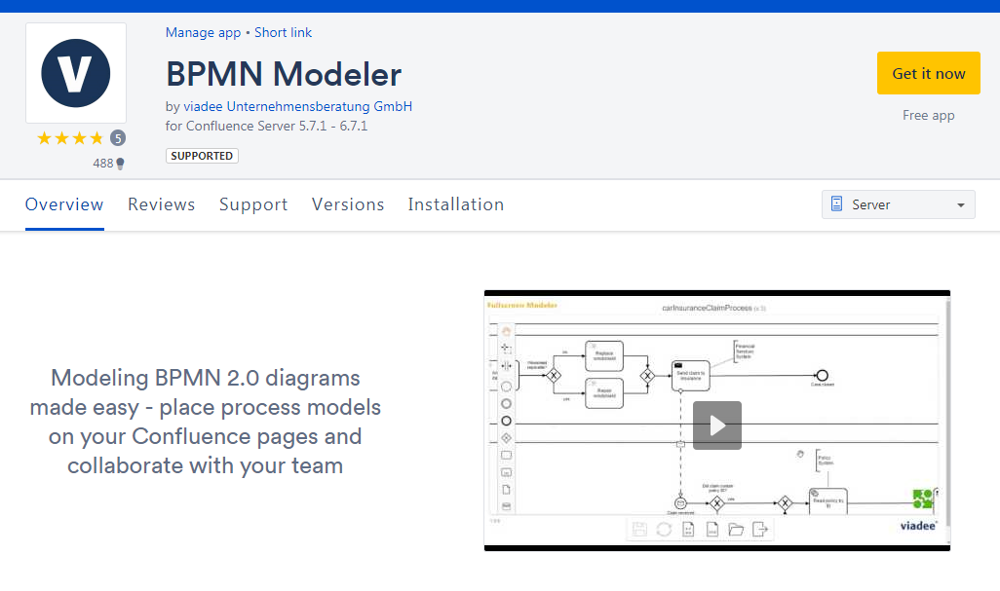
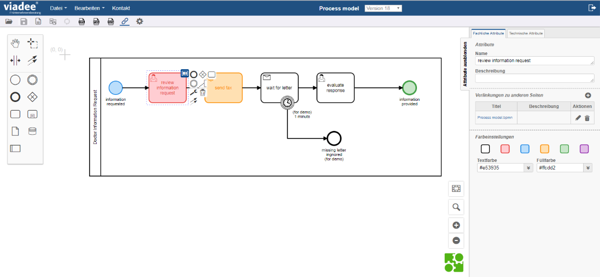
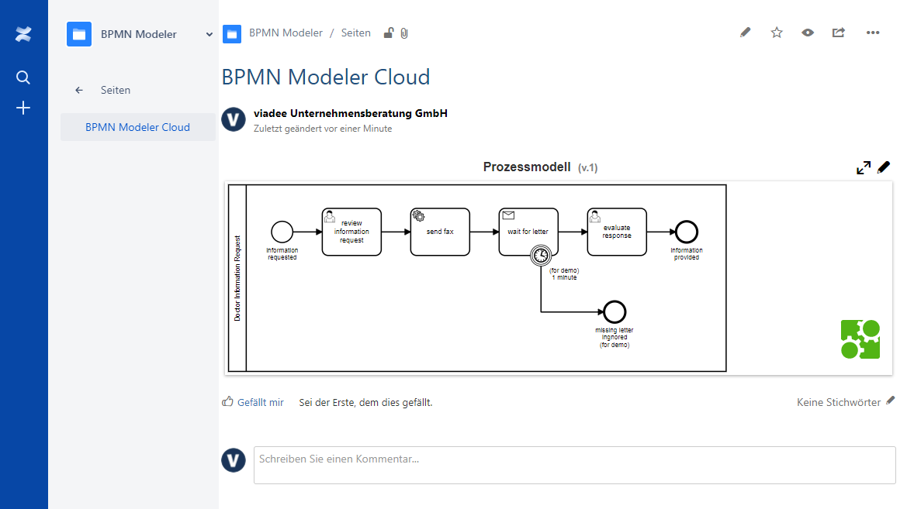

# BPMN Modeler für Confluence - Roadmap

Der BPMN Modeler für Confluence gibt es in unterschiedlichen Versionen. 

Für das **Jahr 2018** sind folgende Features/Releases geplant.

##BPMN Modeler - Marketplace

Die [Markeplace-Version des BPMN Modelers für Confluence](https://marketplace.atlassian.com/plugins/de.viadee.confluence.bpmn-plugin/server/overview) beinhaltet die grundlegenden Funktionen wie z.B. Speichern und Laden von Modellen sowie den Export als Vektorgrafik im SVG-Format.

**Releases/Features**

* Regelmäßige Kompatibilitätsupdates zu Confluence - z.B. bei einer neuen Confluence Version
* Zeitnahe Bugfix Releases
* Update des Layouts
* Kleinere Features

## BPMN Modeler - Enterprise

Die Enterprise-Version beinhaltet noch weitere Features, die im professionellen Enterprisebreich eine große Unterstützung bietet.

**Releases/Features**

+ Verlinkung und Anzeige von Prozessmodellen im Popup-Dialog
+ Kommentare an Prozesselemenete
+ Prozessrepository - zur Strukturierung von Prozessen
+ Weitere kleine Tools für den Prozessdesigner wie z.B.:
  + Ausrichtung von Prozesselementen
  + Gleichmäßige Verteilung von Prozesselementen
  + Durchgängige Anzeige des Poolnamens 
+ Integration eine XML-Code-Editors für die direkte Bearbeitung des Modells
+ Regelmäßige Kompatibilitätsupdates zu Confluence
+ Updates der Core-Libraries von bpmn.io
+ ...

## BPMN Modeler - Cloud

Erste Version als Preview-Version bei der viadee auf Nachfrage erhältlich

